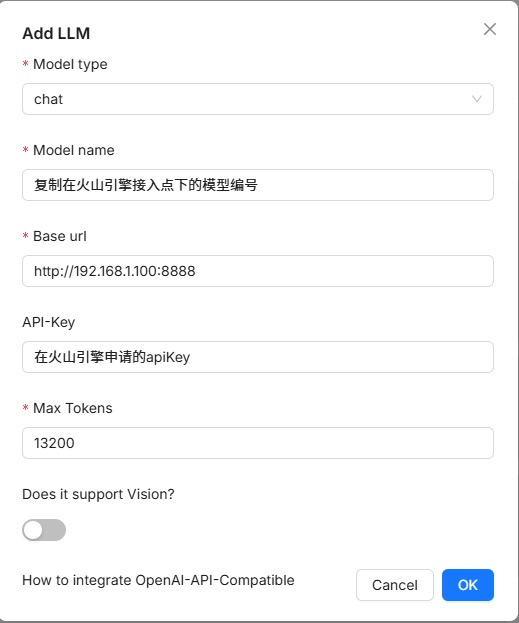
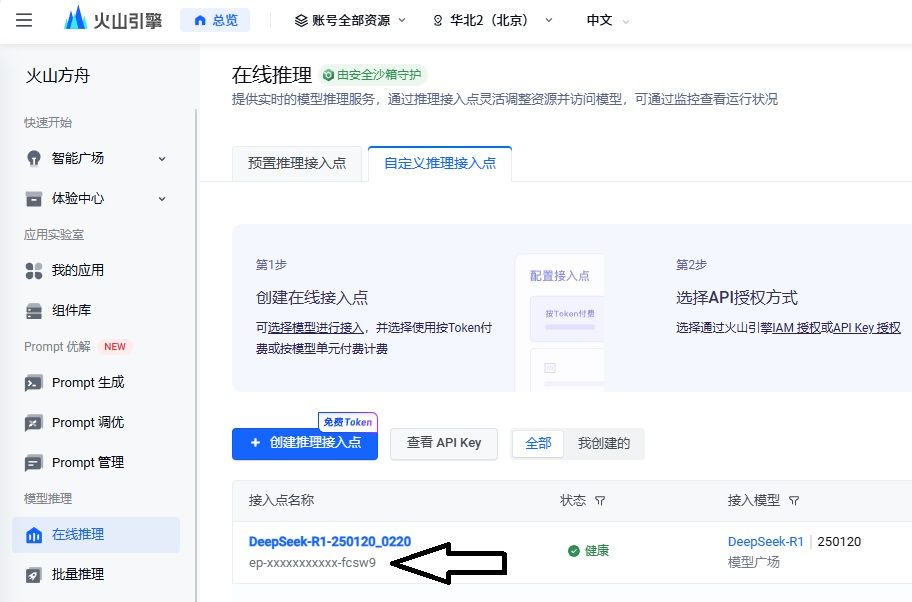

# 火山引擎的模型代理

> 目前 deepseek 的官网服务基本上无法保证稳定、正常的使用。经测试，字节的火山引擎能够提供满血 deepseek 的 API，且接受和输出的 token 数也很高，是最佳的选择。  
> 但是火山引擎与标准的 openAI 的接口不一致，导致在 ragflow 等工具中无法使用。  
> 本项目提供一个简单的代理服务，解决此问题。

## 使用前提

- 电脑上已安装 docker 服务
- 在火山引擎创建了接入点,拥有火山引擎的 apikey（如果没有，请阅读后续说明）

## 构建项目

- 拉取项目

```bash
git clone https://github.com/aardpro/volcengine-proxy.git
```

- 进入项目目录

```bash
cd volcengine-proxy
```

- 构建并运行容器

```bash
docker-compose up -d --build
```

- 停止容器

```bash
docker-compose stop volcengine-proxy
```

- 重启容器

```bash
docker-compose restart volcengine-proxy
```

- 查看日志

```bash
docker-compose logs -f
```

## 在 ragflow 中使用

> 点击用户头像 -> 点击左侧 "Model providers" -> 在 Models to be added 下找到 OpenAI-API-Compatible -> 点击"Add the model"，在弹出的表单中填写配置。  
> 在 Model name 输入 你在火山方舟接入点的名称，参考下图  
> 在 API-Key 输入你的火山方舟申请的 apikey
> 在表单 Base url 输入 http://你本机电脑 ip:8888，如“http://192.168.1.100:8888”



## 在火山引擎的操作

<a href="https://console.volcengine.com/" target="_blank">传送门：https://console.volcengine.com/</a>

> 注册、登录火山引擎 -> 搜索“火山方舟” -> 点击“管理控制台”  
> 点击左侧菜单靠下的“API Key 管理”，创建你的 API Key  
> 点击左侧的“在线推理”，“创建推理接入点”  
> 在 ragflow 中，点击模型名称右侧的铅笔图标，添加模型名称


